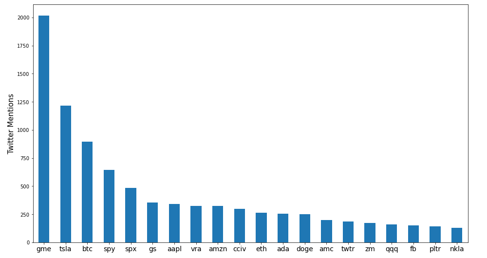
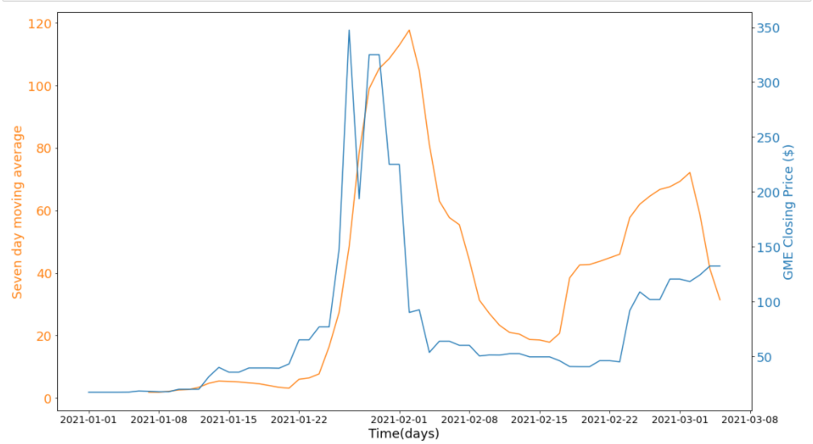

#  Capstone Project

## Executive Summary

### Overview

Over the course of the last few weeks, a new phenomenon was introduced into the world of finance. One name for it would be distributed crowd consensus stock trading. Add a little bit of virality to the equation and Gamestop became the first of a very new breed of stock market trade. THis new movement is unique within the histroy of the stock market as it has redditers, tweeters and average retail trades sitting in the drivers seat for the first time ever. In response to this, new ETFs that track stocks based on thier social media sentiment have launched in response. This investment hypothesis is simple: people are transaprent and discussing their trdes through social media. Aggregate all this data up to the highest level and leverage the "wisdom of the crowd".

### Problem Statement

In order to better understand the network effects of the his phenomenon, test the hypothesis and build a prototype "early warning system" if something similar we're to occur again - the following workboos walk through the worflow of building a tool that scrapes hundreds of thousands of historical tweets, tens of thousands of daily tweets and analyzes/models the relationships between teh frequency of mentions over time, the level of engagement and stock prices for publically traded companies.

A portion of the report is dedicated to data wrangling, cleaning and processing whilst another part is dedicated to model training and predictions. Lastly there is a set of modules written in python that accompany these workbooks that are the engine that drive the front-end website that allows users to engage with the tool in realtime.

The goal of this tool is to serve as an additional input into an investors decision making. The "wisdom of the crowd" should be available to everybody. I could see this tool eventually being integarated as a feature in popular trading apps like Robinhood and Wealthsimple. 

The web-app of the tool hosted on Heroku can be found [here](https://fintwitter.herokuapp.com/)

### Contents of this README

- Executive Summary
- Data-set Description
- Primary Findings and Insights
- Conclusions and Recommendations
- Next Steps

---

### Data-set Overview

#### Data Dictionary

Although there are many datasets and engineered features. These features we're created and explained throughout the workbooks. Below is a data dictioanry of the original source data scrapped from twitter. The alpha advnatage and stock name data is self explanatory (stock names,symbols and closing prices) and is also seperate from this core data dictionary.

|Feature|Type|Dataset|Description|
|---|---|---|---|
|id|float64|twitter_live_2021-03-08.csv / twitter_historical_05.03.21.csv |Unique identifier for each tweet|
|screen_name |string|twitter_live_2021-03-08.csv / twitter_historical_05.03.21.csv | User account name / handle |
|created_at|string|twitter_live_2021-03-08.csv / twitter_historical_05.03.21.csv|The datetime the post was created|
|tweet|string|twitter_live_2021-03-08.csv / twitter_historical_05.03.21.csv|The content of the post|
|followers|float64|twitter_live_2021-03-08.csv / twitter_historical_05.03.21.csv|The number of follers the accoutn owner has|
|retweets|float64|twitter_live_2021-03-08.csv / twitter_historical_05.03.21.csv|The number of retweets the post got|
|likes|float64|twitter_live_2021-03-08.csv / twitter_historical_05.03.21.csv|The number of likes the post got|

#### Provided Data and Workbooks

External requirements

- [Requirements](./requirements.txt)
- [Word2vec/Lexvec is too large to upload but one can be found here (official file name used: lexvec.commoncrawl.300d.W.pos.vectors)](https://github.com/alexandres/lexvec)

For this project, I've used the following workbooks and datasets.

- [Historical Data Collection](./historical_data_collection_1-6.ipynb)
    - Data In:
        - [S&P](./data/constituents_csv.csv) | [Nasdaq](./data/nasdaq-listed_csv.csv) | [NYSE](./data/nyse-listed_csv.csv) |
        - [TSX](./data/TSX.txt) | [TSX-Ventures](./data/TSXV.txt) | [NYSE II](./data/NYSE.txt)
        - [Alphaadvantage API](https://www.alphavantage.co/)
        - [Tweepy API](https://docs.tweepy.org/en/latest/api.html)
        - [SNSScrape API (Not as well documented)](https://medium.com/swlh/how-to-scrape-tweets-by-location-in-python-using-snscrape-8c870fa6ec25)
    - Data Out:
        - [Historical Twitter Data](./data/twitter_historical_05.03.21.csv) | [Stock Symbol List](./data/stock_names.csv) |

- [Live Daily Data Collection](./live_data_collection_2-6.ipynb)
    - Data In:
        - [Tweepy API](https://docs.tweepy.org/en/latest/api.html)
        - [SNSScrape API (Not as well documented)](https://medium.com/swlh/how-to-scrape-tweets-by-location-in-python-using-snscrape-8c870fa6ec25)
    - Data Out:
        - [Daily Twitter Data (Naming Convetion is 'twittter_live_(date).csv' and located in data folder)]

- [Historical Data Processing & EDA](./historical_data_processing_3-6.ipynb)
    - Data In:
        - [Alphaadvantage API](https://www.alphavantage.co/)
        - [Historical Twitter Data](./data/twitter_historical_05.03.21.csv)
    - Data Out:
        - [Processed Historical Twitter Data](./data/twitter_historical_05.03.21_pre-processed.csv)
        - [Historical Twitter Data Aggregated by Time](./data/twitter_historical_05.03.21_pre-processed_agg_time.csv)
        - [Historical GME Price Data](./data/gme_price.csv)
        - [Twitter and Price Data Merged](./data/twitter_historical_merge.csv)

- [ARIMA Time Series Model Training & Evaluation](./ARIMA_modelling_4-6.ipynb)
    - Data In:
        - [Twitter and Price Data Merged](./data/twitter_historical_merge.csv)
    - Data Out:
        - [RNN Model Training Data](./data/data_rnn.csv)
    - Asset Out:
        - [ARIMA Trained Model](./assets/ARIMA_model.csv)

- [Recurrent Neural Network Time Series Modelling](./rnn_model_5-6.ipynb)
    - Data In:
        - [RNN Model Training Data](./data/data_rnn.csv) - Model Training
        - [RNN Model Training Data](./data/merge.csv) - Model Evaluation (LIVE Data from Main Workflow)
    - Data Out:
        - [RNN Model Training History and Evaluation Metrics](./data/rnn_train_history.csv)
    - Asset Out:
        - [RNN Trained Model](./assets/rrn_model.csv)
        - [Standard Scaler Fit Model](./assets/scaler.pkl)
- [Main workflow: Data Combindation, final processing and frontend feature design](./main-workflow_6-6.ipynb)
    - Data In:
        - [Processed Historical Twitter Data](./data/twitter_historical_05.03.21_pre-processed.csv)
        - [Daily Twitter Data_2021-03-08](./data/twitter_live_2021-03-08.csv)
        - [Stock Symbol List](./data/stock_names.csv)
    - Data Out (For use in Stremlit front-end app):
        - [List of top 10 stocks by mention with outlier flags](./data/top_stocks_display.csv)
        - [Dataframe only including tweets mentioning stocks](./data/df_stocks)
        - [Stock dataframe filtered to only include tweets in last week](./data/df_stocks_recent)
        - [Maint Tweet Dataframe](./data/df.csv)

The following python files were used to build the Streamlit front-end app:
- [Main Page](./main.py)
- [Historical GME Analysis](./historical.py)
- [Predictions](./predictions.py)
- [Most Mentioned Stocks Dashboard](./top_mentions.py)
- [Twitter Ticker Search Page](./tweet_search.py)

In order to launch the Streamlit app locally. Download the repo. Download the requirements (as per the requirements folder). Setup your keys. Run through each workbook in order. Then once the final 6th notebook has been run, open your terminal,navigate to the home directors and type: `streamlit run main.py`.

#### Primary Findings & Insights

In the prior 3 months to building this project, the three most mentioned stocks/names were not surprisingly GameStop, Tesla and Bitcoin. That said, when compared with the other two, GameStop had a much larger deviation from the mean in terms of social media activity. Bitcoin and Tesla are in the news quite a bit and I would not reccomend using this tool to infer anything short terms about thematic stocks like them. That said, it's quite possible that 5-10 years from now, we could infer this as signals for their further rise in market share.

GameStop was mentioned roughly as many times as Tesla and Bitcoin combined in the same time period. See Image below.

The next part of my analysis focused on whether this was a reactive relationship or a causal one. In order to properly analyze the frequency of mentions over time, I needed to smooth the historical data as it is typically filled with peaks and troths. To do this I calculated the seven day moving average of the frequency of mentions. The seven day moving average showed a 66% better correlation with the price data - a 4% improvement from the original mentions data.

A key observation from the seven day moving average (which can be seen below), is that it rarely sees a 20-30x increase over the span of two weeks. This was a unique feature seen in the GME data and helped inform the logic used in my analysis of live twitter data to flag another future "black swan" event.

Given how random the GME event was, I did not want to build a model and apply it to all twitter stock data. This would prove disastrous and result in poor predictions. To compensate for this I decided to evaluate each of the weeks top 10 stocks by mentions using both outlier occurence and statistics infered from the GME event to flag a given stock name for predictions. Essentially if the stock is going viral, then let's model it with a model trained on the GME dataset.

I trained and evaluated both an ARIMA and RNN model. Ultimatley I selected the RNN model as performance was the goal here. The RNN model is a classification model that determines whether or not a given stock price will be higher than it is today five days from now. The thinking is as follows. If a stock is being flagged for an irregular upward trend and virality similar to GME, then let's model it to help inform a decision of whether or not the opportuninty is fully played out or still has room to run.

The production model scored 84% on the training data & 62% on the test data. A noticeable improvement over the baseline accuracy  of 58% (simply taking the average).  

Anecdotally, it has flagged GME once again and has predicted its price will continue to increase over the next few weeks (writing this as of March 8th, 2021, so will need to come back and evaluate). That being said, in practice, I would only use the model to inform the shortest term possible investment decisions (e.g. should I invest today?tomorrow?). All time series forecsating inherently struggles over the long term and knowing this limitation, I believe it is prudent to pull new data and re-run the model daily for new predictions.

#### Conclusion & Recommendations

The tool that I have built is an invaluable asset to those that follow the stock market closely. Although professional money managers and hedge funds likely have their own be-spoke social media data solutions that inform their day-day decisions, most small shops and retail investors do not. I beleive this tool (in a full production state) could be a very useful feature for the Robinhoods and Welathsimples of the world to offer their users. This tools relevance will only increase over time.  

It may also serve as a standstill solution for investors to check-in on new investment decisions or the overall sentiment of their existing portfolio. Further improvements to be made to get it there.

#### Next Steps

Moving onto the next phase of this project will require a full stack solution (e.g. database backend, more robust front-end and additional compute power). There are many ideas to improve the workability of this product from its current prototype form. Please reachout to me directly if you have any questions or are interested in using this solution. It is also imperitive to train the RNN prediction model on more data. So as more of these exogenous events occur, it will be crucial to collect and grow the model training dataset.

Thank you!
